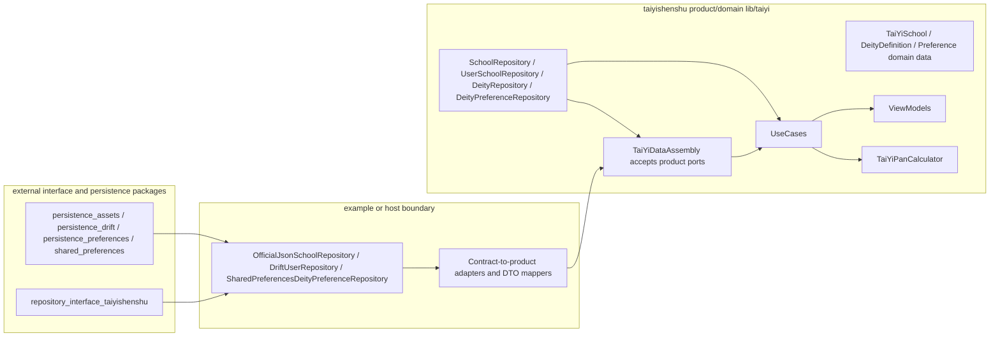

## Context

Branch and workspace audit on 2026-06-07:

- Current branch: `storage-refactor/taiyishenshu`.
- Pre-existing or concurrent dirty files observed: `AGENTS.md`, `CLAUDE.md`, `lib/taiyi/taiyi_pan_calculator.dart`, `regression-report.md`, and later metadata regression tests/vectors. These are treated as other-agent work and are not part of this OpenSpec change.
- GitNexus index was refreshed with `npx gitnexus analyze`; result: 5,127 nodes, 9,555 edges, 706 clusters, 180 flows.

Architecture audit:

- `lib/taiyi/usecases/*.dart` imports product files such as `../core/school_repository.dart` and does not directly import persistence packages.
- `lib/taiyi/viewmodels/*.dart` does not directly import persistence packages.
- `example/lib/taiyi_host.dart` imports `shared_preferences`, `persistence_assets`, `persistence_drift`, and `persistence_preferences`, creates `OfficialJsonSchoolRepository`, `DriftUserRepository`, and `SharedPreferencesDeityPreferenceRepository`, then injects them into `TaiYiDataAssembly`.
- `lib/taiyi/core/school_repository.dart` imports and exports `repository_interface_taiyishenshu`, defines product repository ports, re-exports contract DTOs and `DeityPreferenceRepository`, and owns product/contract DTO mappers.
- `lib/taiyi/taiyi_assembly.dart` imports `repository_interface_taiyishenshu`, accepts contract-typed ports, wraps them with private adapters, and injects product-typed ports into usecases.
- `pubspec.yaml` lists `repository_interface_taiyishenshu` as a runtime dependency and dependency override; persistence packages are dev dependencies.

## Goals / Non-Goals

**Goals:**

- Make product `lib/taiyi/**` compile without importing `repository_interface_taiyishenshu`.
- Keep usecases, viewmodels, and pan calculation behavior stable.
- Make repository contract adaptation a host/adapter concern rather than product logic.
- Preserve current backend composition: assets for official data, Drift for user data, SharedPreferences for deity preferences.
- Provide migration tasks that protect concurrent work and require validation before implementation is accepted.

**Non-Goals:**

- Do not implement algorithm management system configuration in this change.
- Do not modify `lib/taiyi/taiyi_pan_calculator.dart`.
- Do not change official/user persistence schema semantics unless required by adapter movement.
- Do not move persistence packages into product runtime dependencies.
- Do not archive the OpenSpec change before implementation and delivery evidence exist.

## Candidate Strategies

### Strategy A: Pure Product Ports, Host Adapts Contracts

Product `lib/taiyi/**` owns only domain models and product repository ports. `TaiYiDataAssembly` accepts product ports. Contract DTO mapping and contract repository wrappers are implemented at the host/test boundary.

Pros:

- Fully removes `repository_interface_taiyishenshu` from product runtime dependency.
- Keeps product usecases/viewmodels aligned with domain models.
- Makes host responsibility explicit and matches the current `example/lib/taiyi_host.dart` backend seam.
- Offers the clearest final static boundary check.

Cons:

- Breaking change for callers that instantiate `TaiYiDataAssembly` with contract repos.
- Requires updating tests that currently inspect `assembly.officialRepo` as contract type or use product `.toContract()` extensions.
- May duplicate adapters if multiple hosts need them unless a shared adapter package is later added.

Completeness: 9/10.

### Strategy B: Dedicated Adapter Package

Product exposes domain models and ports only. A separate adapter package owns `repository_interface_taiyishenshu` mapping and wraps contract repos into product ports. Host imports product, persistence, interface, and adapter package.

Pros:

- Fully removes contract dependency from product.
- Avoids duplicating adapters across future hosts.
- Cleanest long-term package topology if many product packages share the same storage architecture.

Cons:

- Requires creating or selecting an adapter package location outside the current product package.
- Adds cross-package coordination and likely dependency graph changes beyond this repository.
- Higher upfront cost and more moving pieces for this single boundary change.

Completeness: 8/10.

### Strategy C: Transitional Compatibility Layer

Keep a temporary compatibility export/adapter in product while switching usecases/viewmodels to product ports and marking contract exports deprecated.

Pros:

- Lowest immediate breakage for current tests and callers.
- Allows staged migration with fewer simultaneous changes.

Cons:

- Does not meet the target of thoroughly stripping `repository_interface_taiyishenshu` from product logic/runtime dependency.
- Keeps product package responsible for contract DTOs, so the boundary remains impure.
- Risks becoming permanent compatibility debt.

Completeness: 5/10.

## Recommended Decision

Recommend Strategy A for this repository change, with one explicit extension point: if another host needs the same adapters, extract them into Strategy B as a follow-up adapter package after this package proves the pure boundary.

Rationale:

- The existing architecture already has `example/lib/taiyi_host.dart` as the backend construction boundary.
- Usecases and viewmodels already consume product ports, so the main remaining work is moving adapter/mapping ownership and changing `TaiYiDataAssembly` constructor types.
- Strategy A satisfies the dependency-removal acceptance condition without creating a new package in this phase.

## Target Architecture

## Migration Plan

Phase 0: Safety and audit

- Reconfirm branch is `storage-refactor/taiyishenshu`.
- Record dirty files and do not overwrite unrelated changes.
- Run GitNexus impact analysis before editing production symbols during implementation.
- Re-run import scans to establish current dependency baseline.

Phase 1: Product port purification

- Define or retain product-only `SchoolRepository`, `UserSchoolRepository`, `DeityRepository`, and product-owned `DeityPreferenceRepository` in product core without contract imports.
- Remove contract DTO re-exports and product/contract mapper extensions from product core.
- Ensure usecases/viewmodels still import only product ports.

Phase 2: Assembly boundary migration

- Change `TaiYiDataAssembly` constructor and exposed fields to product port types.
- Keep `_MultiSchoolAdapter` product-typed.
- Remove private contract adapters from product assembly.
- Avoid changing pan calculator behavior.

Phase 3: Host/test adapter relocation

- Move contract DTO mappers and contract-to-product repository wrappers into `example/lib/taiyi_host.dart`, a host-side helper, or test harness helper.
- Update `example/lib/taiyi_host.dart` to construct backend repos, wrap them as product ports, and inject product ports into `TaiYiDataAssembly`.
- Update tests that currently use contract DTOs or `.toContract()` to use host/test adapters or product fakes.

Phase 4: Dependency cleanup

- Remove `repository_interface_taiyishenshu` from runtime `dependencies` and runtime dependency override in `pubspec.yaml` if product no longer imports it.
- Keep contract/persistence packages in dev dependencies only if tests or example compilation require them. If example runtime needs them as a host dependency, document why and do not reintroduce them to product `lib/taiyi/**`.

Phase 5: Validation and review

- Run static import boundary scans.
- Run Dart/Flutter analyzer.
- Run focused usecase, viewmodel, repository boundary, assembly, and integration tests.
- Run gStack architecture checklist and QA checklist before allowing implementation to be marked ready.

## Test Gates

- Static boundary gate:
  - `rg -n "^import .*repository_interface_taiyishenshu|^export .*repository_interface_taiyishenshu|^import .*persistence_|^import .*shared_preferences|^import .*drift" lib/taiyi`
  - Expected: no matches.
- Dependency gate:
  - `rg -n "repository_interface_taiyishenshu" pubspec.yaml`
  - Expected: absent from runtime dependencies; any remaining dev/test or host rationale must be documented.
- Analyzer gate:
  - `flutter analyze`
  - Expected: no new errors from boundary migration.
- Focused unit/widget gates:
  - Usecase tests covering load/copy/save/delete/toggle/calculate.
  - ViewModel tests for school and deity workflows.
  - Assembly injection tests updated to product ports.
- Integration gates:
  - Official and user coexistence remains intact.
  - User school/deity save and reload still persists through Drift.
  - Preference persistence still persists through SharedPreferences.
  - Pan recalculation still sees expected school/deity data through product ports.

## Rollback Plan

- Do not revert unrelated dirty files.
- If implementation breaks product behavior, revert only files touched by the repository-boundary implementation branch.
- If host adapter relocation fails late, temporarily restore contract adapters in a host/test helper while keeping product imports clean.
- If dependency removal breaks example/test resolution, re-add `repository_interface_taiyishenshu` only as a dev/test or host-side dependency with a documented rationale, not as a product runtime dependency.
- OpenSpec remains unarchived until implementation, tests, review, and delivery evidence pass.

## gStack Review Notes

Readable gStack docs used:

- `/Users/jingtaiwei/.codex/skills/gstack/SKILL.md`: gStack is the product validation layer; architecture work should inspect relevant plan review skills, and QA evidence should come from the relevant QA skill.
- `/Users/jingtaiwei/.gemini/skills/gstack-plan-eng-review/SKILL.md`: plan engineering review covers architecture, data flow, diagrams, edge cases, test coverage, performance, and unresolved decisions.
- `/Users/jingtaiwei/.gemini/skills/gstack-qa-only/SKILL.md`: report-only QA produces structured evidence, health score, screenshots/repro steps for web apps, and never fixes bugs; for backend/config changes it still scopes testing to affected behavior and checks test plans.

This change is not UI-heavy. gStack validation should therefore focus on architecture review evidence and QA checklist completeness rather than browser screenshots, unless a host app route is available for smoke testing.

## Risks / Trade-offs

- Breaking assembly callers -> mitigate by updating example and test harness adapters in the same implementation phase.
- Adapter duplication in host/test -> mitigate by extracting a dedicated adapter package later if reuse pressure appears.
- Contract DTO mapper drift -> mitigate with focused mapper tests at the host/test boundary until Strategy B extraction exists.
- Tests that assert runtime type names may fail -> mitigate by changing assertions to boundary behavior rather than concrete contract implementation exposure.
- Concurrent dirty files may be overwritten by accident -> mitigate by rechecking `git status --short` before edits and touching only planned files.

## Open Questions

- Should adapter helpers live directly in `example/lib/taiyi_host.dart`, in `example/lib/taiyi_contract_adapters.dart`, or in a new non-product adapter package? Recommended for this phase: host/test helper files, not a new package.
- Should `DeityPreferenceRepository` remain in `school_repository.dart` or move to a clearer product file such as `deity_preference_repository.dart`? Recommended for implementation: choose the smallest move that keeps imports stable, unless symbol impact is low and tests are easy to update.
